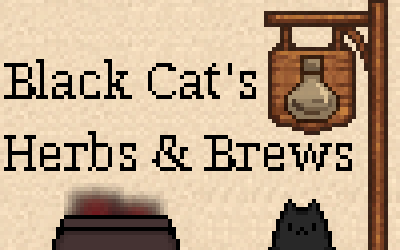

  

# Black Cat's Herbs & Brews

You and your familiar just arrived to a small village. Your new home, away from the bustling city.

Brew and sell your potions to the villagers so you can pay rent, upgrade your shop and, more importantly, feed your familiar, otherwise she'll knock your potions and ingredients off the shelves.

----

# Play
Play the live version: https://black-cats-herbs-and-brews.dosaki.net/

This is a game developed for [js13kgames 2025 competition](https://2025.js13kgames.com/) with the theme "**Black Cat**".

# Controls
* Click the cupboard to see your inventory
* Click the cauldron to brew
* Drag items from the cupboard to your cauldron to select ingredients
* Drag animal products to your familiar to feed her
* Drag items to the villagers to sell them (if they want them)

# Tips
* You can try to guess the potion recipes, if you don't want to buy it.
* Don't accrue too much debt